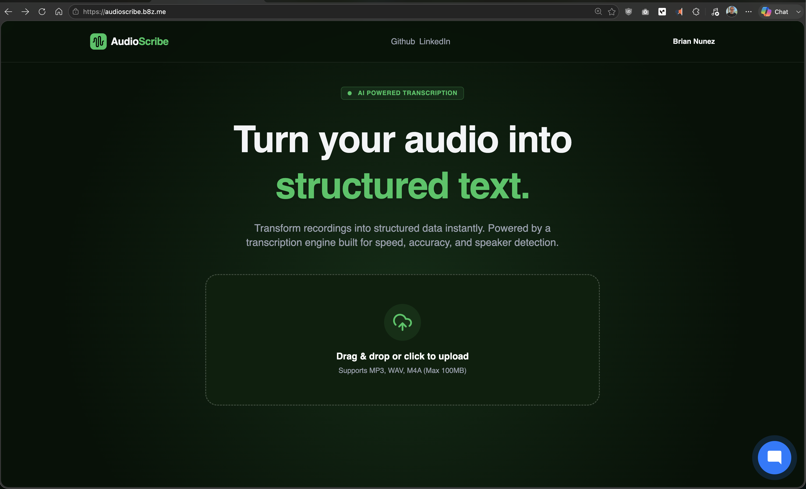

# BScribe (AudioScribe)

> [!CAUTION]
> **This project has been decommissioned and is no longer maintained.**
> No further development, bug fixes, or security patches will be provided. This repository is archived for reference purposes only. Use at your own risk.



---

## Overview

BScribe (branded as "AudioScribe" in the UI) is a self-hosted web application for transcribing audio files. Users upload audio via a drag-and-drop web interface, the server forwards it to an external [whisper.cpp](https://github.com/ggerganov/whisper.cpp)-based transcription service, and results are displayed as timestamped segments.

---

## Tech Stack

| Layer | Technology | Version |
|---|---|---|
| Language | Go | 1.23.2 |
| Web Framework | [Echo](https://echo.labstack.com/) | v4.13.4 |
| Templating | [Templ](https://templ.guide/) | v0.3.924 |
| Styling | [TailwindCSS](https://tailwindcss.com/) | Utility-first, compiled to `output.css` |
| UI Components | [Templ UI](https://templui.io/) | v0.85.0 (40 pre-built components) |
| Interactivity | [HTMX](https://htmx.org/) | v1.9.10 |
| Icons | Lucide Icons | Go bindings via `go-templ-lucide-icons` |
| Chat Widget | [n8n](https://n8n.io/) | Custom JS widget |
| Container | Docker | Multi-stage Alpine build |
| Dev Tools | [Air](https://github.com/air-verse/air) (live reload), Make |

---

## Architecture

```
cmd/main.go  →  httpserver.Bootstrap()  →  Echo server (port 8080)
                    ├── Static assets (/assets)
                    ├── Middleware (Gzip, Recover, RequestID, CORS, Logger)
                    ├── Custom error handler
                    ├── v1.RegisterRoutes()
                    │   ├── GET  /              → Transcribe page (HTML)
                    │   ├── GET  /api/v1/health → JSON health check
                    │   ├── POST /api/v1/upload → File upload + async transcription
                    │   └── POST /api/v1/transcription/:filename → Poll for results
                    └── 404 catch-all
```

### Request Flow

1. User uploads audio (MP3, WAV, or M4A — max 100MB) via the drag-and-drop form
2. `UploadHandler` generates a unique filename and forwards the file to the external transcription service via multipart POST in a goroutine
3. Server immediately returns an HTMX progress skeleton
4. HTMX auto-polls `/api/v1/transcription/:filename` every 1 second
5. `TranscriptionResultHandler` checks an in-memory `sync.Map` cache — returns the progress skeleton if not ready, or the final `TranscriptionResult` component when done
6. Results display as a table: `HH:MM:SS,ms` time range → transcribed text

---

## Project Structure

```
├── cmd/                    # Entrypoint (main.go)
│   └── main.go             # Bootstrap server, graceful shutdown
├── internal/               # Application logic
│   ├── handlers/
│   │   ├── errors/         # Centralized error response builder
│   │   └── v1/
│   │       ├── routes.go   # Route registration
│   │       ├── upload.go   # Upload + transcription handlers (core logic)
│   │       ├── health.go   # Health check endpoint
│   │       └── ui/
│   │           └── home.go # Home page renderer
│   └── httpserver/
│       ├── server.go       # Bootstrap function
│       └── builder.go      # Fluent builder for Echo server setup
├── views/
│   ├── pages/
│   │   ├── layout.templ    # Base HTML layout (loads CSS, HTMX, n8n widget)
│   │   └── transcribe.templ # Main page: upload widget, progress, results table
│   ├── utils/
│   │   └── templui.go      # Templ UI utilities (TwMerge, If, RandomID, etc.)
│   └── components/         # 40 Templ UI component directories
├── assets/
│   ├── css/
│   │   └── input.css       # TailwindCSS config (custom theme, Inter font)
│   └── js/
│       ├── lib/            # HTMX local copy
│       ├── templui/        # Templ UI JS
│       └── n8n-chat.js     # Embedded AI chat widget
├── whisper/                # Test data & model downloads
│   ├── baptized_in_fear.mp3   # Sample audio (4MB)
│   ├── baptized_in_fear.json  # Sample whisper output (86KB)
│   └── Makefile               # Downloads whisper.cpp base model
├── compose.dev.yml         # Docker Compose for full-stack deployment
├── Dockerfile              # Multi-stage Alpine build
├── Makefile                # Dev workflow (templ, tailwind, air watchers)
├── DESIGN.md               # Original design document
├── .templui.json           # Templ UI configuration
├── go.mod
└── go.sum
```

---

## Key Files

### `compose.dev.yml`
- Docker Compose file for running the full stack (BScribe + whisper.cpp + Consul)
- All services use `network_mode: "host"` so they communicate over `127.0.0.1`
- BScribe points to whisper at `http://127.0.0.1:8081/inference`
- Whisper runs with the `ggml-base.bin` model mounted from `./models`
- Consul agent reads config from `./consul-config/`

### `cmd/main.go`
- Application entrypoint
- Bootstraps the HTTP server with static asset directories
- Reads `PORT` env var (default: `8080`)
- Graceful shutdown on `SIGTERM`/`SIGINT` with 10-second timeout

### `internal/httpserver/builder.go`
- Builder pattern for Echo server setup
- Fluent API: `WithDefaultMiddleware()`, `WithRoutes()`, `WithErrorHandler()`, `WithNotFound()`, `WithStaticAssets()`

### `internal/handlers/v1/upload.go`
- Core transcription logic
- `UploadHandler`: Generates unique filename, reads uploaded file, constructs multipart POST to external service, fires goroutine, immediately renders progress UI
- `TranscriptionResultHandler`: Polling endpoint — returns result or re-renders progress component
- Uses `sync.Map` as in-memory cache for transcription results

### `internal/handlers/errors/errors.go`
- Builder pattern for structured JSON error responses
- Error types: `INVALID_REQUEST`, `UNAUTHORIZED`, `NOT_FOUND`, `NOT_ALLOWED`, `INTERNAL_SERVER_ERROR`, `SERVICE_UNAVAILABLE`
- `GenerateByStatusCode()` maps HTTP codes to error builders

### `views/pages/transcribe.templ`
- Main page (237 lines)
- Key types: `TranscriptionSegment` (Start, End, Text), `TranscriptionResponse` (Segments, Text)
- Components: `Transcribe()`, `UploadWidget()`, `TranscriptionProgress()`, `TranscriptionResult()`, `Navbar()`, `Footer()`
- `formatTimestamp()` converts float64 seconds → `HH:MM:SS,ms` format

---

## Environment Variables

| Variable | Default | Purpose |
|---|---|---|
| `PORT` | `8080` | HTTP server port |
| `TRANSCRIPTION_SERVICE_URL` | `http://10.0.0.114:8081/inference` | External whisper.cpp transcription API endpoint |

---

## API Routes

| Method | Path | Description | Response |
|---|---|---|---|
| `GET` | `/` | Main transcription page | HTML |
| `GET` | `/api/v1/health` | Health check | `{"status": "ok"}` |
| `POST` | `/api/v1/upload` | Upload audio file for transcription | HTML fragment (HTMX) |
| `POST` | `/api/v1/transcription/:filename` | Poll for transcription result | HTML fragment (HTMX) |
| `GET` | `/assets/*` | Static file server | CSS, JS, images |

---

## Build & Run

### Docker Compose (Recommended)

The easiest way to run the full stack is with the provided `compose.dev.yml`, which starts all three services on the host network:

| Service | Image | Port | Purpose |
|---|---|---|---|
| `audioscribe` | `briannunez/bscribe:v1.0.8` | `8080` | BScribe web application |
| `whisper` | `ghcr.io/ggml-org/whisper.cpp:main` | `8081` | whisper.cpp transcription server |
| `consul-client` | `hashicorp/consul:1.18` | — | Consul agent (reads config from `./consul-config`) |

**Prerequisites:**
- A whisper model at `./models/ggml-base.bin` (download via `cd whisper && make`)
- Consul config files in `./consul-config/` (if using service discovery)

```bash
docker compose -f compose.dev.yml up -d
```

The app is available at `http://localhost:8080`.

### Local Development

Requires: Go 1.22+, templ CLI, tailwindcss CLI, air

```bash
make dev
```

This starts 3 parallel watchers:
- `templ` — template generation with proxy on `localhost:8090`
- `tailwindcss` — CSS compilation with watch + minify
- `air` — Go live-reload

### Standalone Docker Build

```bash
docker build \
  --build-arg TRANSCRIPTION_SERVICE_URL=http://your-whisper-service:8081/inference \
  -t bscribe .

docker run -p 8080:8080 bscribe
```

---

## Design Decisions

- **Async transcription with HTMX polling** — Upload fires a goroutine and immediately returns a loading skeleton. HTMX polls every 1s until the result is ready. No WebSockets needed.
- **In-memory `sync.Map` cache** — Transcription results live only in memory. No database. Results are lost on restart.
- **External transcription service** — The app delegates transcription to a separate whisper.cpp server. It does not run whisper locally.
- **Builder pattern** — Both the HTTP server and error responses use builder patterns for fluent configuration.
- **Server-rendered SPA feel** — HTMX swaps HTML fragments in-place, giving SPA-like UX without a JS framework.
- **DESIGN.md vs implementation gap** — The design doc describes SQLite, Docker SDK worker pool, job queue, and container orchestration. None of that was implemented. The app remained stateless with a single goroutine per upload.

---

## Original Links

- [GitHub — brian-nunez](https://www.github.com/brian-nunez)
- [LinkedIn — Brian Nunez](https://www.linkedin.com/in/brianjnunez)
